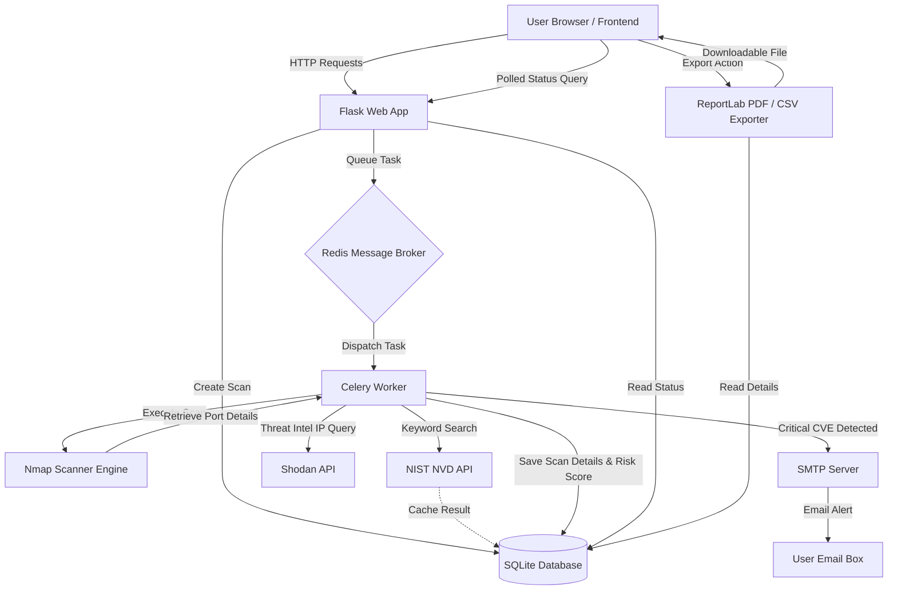
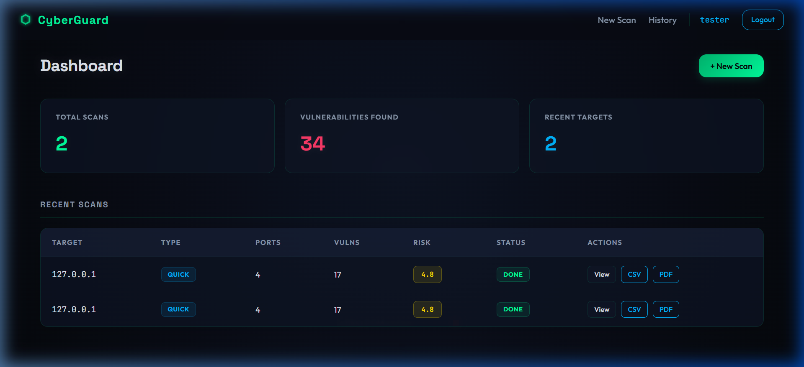
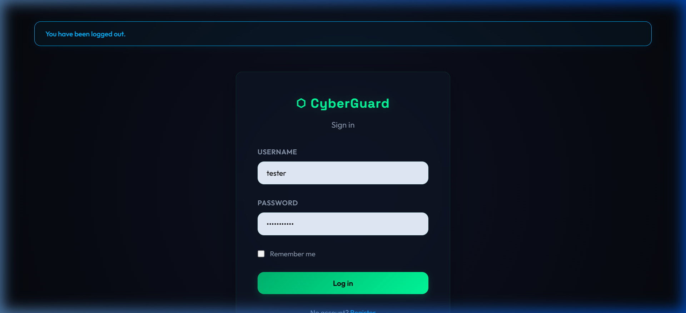

# CyberGuard — Network Vulnerability Scanner

An asynchronous, full-stack network vulnerability scanner and threat intelligence platform built with Python, Flask, Celery, and Nmap.


---

## ⚠ Legal Disclaimer

**Only scan systems you own or have explicit written permission to test.**  
Unauthorized port scanning and vulnerability testing may violate local and international cybersecurity laws (such as the Computer Misuse Act or CFAA).

---

## Features

* **Asynchronous Scanning**: Wraps system-level Nmap binaries inside Celery background workers to scan ports, services, and run vulnerability scripts without blocking Flask threads.
* **CVE Enrichment**: Correlates identified services with live vulnerability data using the NIST NVD API (with fallback support across CVSS v3.1, v3.0, and v2).
* **Caching Layer**: Local SQLite caching of CVE requests (`NvdCache`) to prevent redundant API queries and respect external rate limits.
* **Threat Intelligence**: Performs Shodan lookup queries on public target IPs to gather ASN, ISP, location metadata, and open-port configurations.
* **Scheduled Scans**: Recurring scans (e.g., daily, weekly intervals) managed through background APScheduler cron instances.
* **Alerting**: Dispatches automated SMTP email alerts when critical severity vulnerabilities (CVSS >= 9.0) are found.
* **Security Controls**: Features route-specific rate limits (Flask-Limiter) for login (10/min), registration (5/hr), and scanning (20/hr), scrypt password hashing, and secure session management.
* **Reporting**: Exports detailed scan results to high-contrast PDF reports via ReportLab and tabular spreadsheet outputs via CSV.

---

## System Architecture



---

## Screenshots & Demonstration

* **Project Demonstration (Walkthrough)**:
  

* **Dashboard (Desktop View)**:
  

* **Authentication (Login View)**:
  

---


## Installation & Setup

### Prerequisites
- Python 3.12+
- Nmap scanner binary installed and configured in your system's PATH.
- Redis server running locally or accessible via network.

### Steps

1. **Clone the Repository**
   ```bash
   git clone https://github.com/sairajnaikwade/cyberguard.git
   cd cyberguard
   ```

2. **Configure Environment Variables**
   Create a `.env` file from the example template:
   ```bash
   cp .env.example .env
   ```
   Open `.env` and fill in the required variables (e.g., `SECRET_KEY`, `SHODAN_API_KEY`, and `SMTP` configs).

3. **Install Dependencies**
   It is recommended to run the app inside a virtual environment:
   ```bash
   python -m venv .venv
   source .venv/bin/activate  # On Windows: .venv\Scripts\activate
   pip install -r requirements.txt
   ```

4. **Initialize the Database**
   Apply migrations to generate the baseline database structure:
   ```bash
   flask db upgrade
   ```

5. **Start the Background Workers & Server**
   Start the Redis broker (if running locally). Then run the Celery worker and the Flask application in separate terminal windows:
   
   **Run Celery worker:**
   ```bash
   celery -A celery_worker.celery_app worker --loglevel=info
   ```
   
   **Run Flask web application:**
   ```bash
   flask run
   ```

---

## Docker Deployment

Alternatively, you can run the complete stack (Flask, Celery, and Redis) using Docker Compose:

```bash
docker compose up --build -d
```

Ensure Nmap is available on the host machine or that raw network sockets capabilities are mapped to the scanning container.

---

## Test Suite & Quality Gates

The project contains a comprehensive test suite covering routing, database models, background scheduler queues, report formatting, and mock external API responses.

### Running Tests Locally
To execute the pytest suite with code coverage:
```bash
pytest --cov=. --cov-report=term-missing tests/
```

### Test Output and Coverage Status
```text
Name                              Stmts   Miss  Cover   Missing
---------------------------------------------------------------
app.py                               73      2    97%   114-115
celery_worker.py                      7      1    86%   9
extensions.py                         3      0   100%
models.py                            92      4    96%   31, 82, 93, 121
routes/__init__.py                    0      0   100%
routes/admin.py                      45      0   100%
routes/auth.py                       62      5    92%   20, 49, 51, 55, 57
routes/reports.py                    95      0   100%
routes/scanner.py                   106      1    99%   34
scanner_engine.py                   201      3    99%   137, 152, 257
tests/conftest.py                    51      0   100%
tests/test_advanced_features.py     319      0   100%
tests/test_auth.py                   30      0   100%
tests/test_models.py                 35      0   100%
tests/test_scanner.py                79      0   100%
---------------------------------------------------------------
TOTAL                              1198     16    99%

======================= 52 passed, 96 warnings in 8.83s =======================
```

---

## License

MIT — free to use, modify, and distribute.
