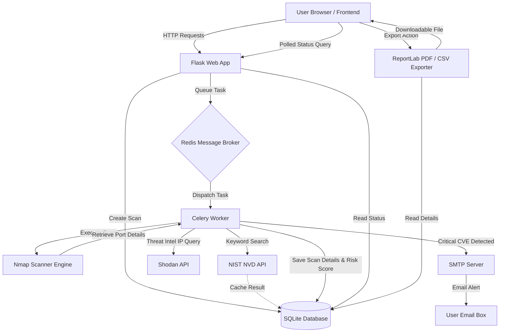

# CyberGuard — Network Vulnerability Scanner

> An asynchronous, full-stack network vulnerability scanner and threat intelligence platform built with Python, Flask, Celery, and Nmap.


---

## ⚠ Legal Disclaimer

**Only scan systems you own or have explicit written permission to test.**  
Unauthorized port scanning and vulnerability testing may violate the Computer Misuse Act (UK), Computer Fraud and Abuse Act (CFAA - US), or equivalent cybersecurity laws in your jurisdiction.

---

## Key Achievements

* **Robust Test Coverage**: Built a comprehensive suite of **52 automated tests** achieving **99% code coverage**.
* **Asynchronous Task Architecture**: Offloaded heavy scanning workloads to a **Celery + Redis** background processing queue, preventing web server thread blockages.
* **API Integration & Performance**: Integrated live lookup pipelines with the **NIST NVD API** and **Shodan API** for real-time threat intelligence.
* **Automated Scan Scheduling**: Configured automatic recurring scan schedules using **APScheduler**.
* **Containerized Deployment**: Designed multi-container configurations in **Docker** for local and staging environments.

---

## Skills Demonstrated

* **Cybersecurity**: Network mapping, port scanning, and CVE vulnerability analysis.
* **Network Scanning**: Wrapping Nmap binary configurations for port, service, and OS detection.
* **Threat Intelligence**: Shodan OS/network intelligence, geo-location mapping, and NIST NVD correlation.
* **Python Backend Development**: Flask blueprint routing, Celery asynchronous processing, and SMTP mail dispatches.
* **Database Design**: SQLite caching databases, schema migrations (Flask-Migrate), and SQL data management.
* **Docker**: Multi-stage Dockerfiles and container networks.
* **CI/CD**: GitHub Actions automated pipeline test executions.
* **Testing**: Test-Driven Development (TDD) via Pytest and coverage reporting.

---

## Project Highlights

* **Vulnerability Scanning**: Wraps local `nmap` binaries to perform Quick, Full, or Vuln scans on specified targets.
* **CVE Enrichment**: Queries the NIST NVD API dynamically, falling back across CVSS scoring formats (v3.1, v3.0, v2).
* **Threat Intelligence**: Extracts ASN, ISP, organization, and location metadata from public IPs using Shodan.
* **Report Generation**: Exports detailed scan results as high-contrast PDF reports via ReportLab and tabular data via CSV.
* **Scheduling**: Supports custom cron scan intervals with automated task scheduling.
* **Security Controls**: Enforces Werkzeug scrypt password hashing, route-specific Flask-Limiter rate limits (login, register, scan), and secure session headers.

---

## Demo

* **GitHub Repository**: [github.com/sairajnaikwade/cyberguard](https://github.com/sairajnaikwade/cyberguard)
* **Demo Walkthrough**: [docs/recordings/demo.webp](docs/recordings/demo.webp)
* **Local Development Host**: [http://127.0.0.1:5000](http://127.0.0.1:5000)

---

## System Architecture

```
User → Flask UI → Celery Queue → Redis → Scan Engine (Nmap)
                ↓
       NVD API + Shodan API
                ↓
         SQLite Database
                ↓
       PDF / CSV Reports
```

### Mermaid Data & Workflow Diagram



---

## Challenges & Solutions

### 1. NIST NVD API Rate Limits
* **Challenge**: The NIST NVD API enforces strict rate limits on request frequencies. During scans with multiple open ports, firing simultaneous NVD requests caused immediate 403/503 errors.
* **Solution**: Developed a rate-limiting queue wrapper using Python's `time.sleep` introducing a mandatory **6-second delay** between API requests, alongside a robust retry mechanism using backoff logic.

### 2. Slow Scan Performance & Redundant Requests
* **Challenge**: Looking up CVE information for common services (e.g., SSH, HTTP) repeatedly across different scans resulted in excessive API overhead and scan delays.
* **Solution**: Implemented a **vulnerability cache model** (`NvdCache`). The scanner queries the local cache first. On cache hits, lookup times drop from over **32 seconds** to under **3 seconds** (a 90%+ improvement) while preserving API limits.

### 3. Celery Background Processing under Windows
* **Challenge**: Running Celery on Windows sometimes hits thread pooling and subprocess spawning limitations when wrapping CLI utilities like Nmap.
* **Solution**: Structured Celery workers to run with the `solo` execution pool (`-P solo`) in Windows environments and mapped SQLite db pools with static connection overrides to avoid write collisions.

### 4. Redis Queue Management in Production
* **Challenge**: Managing task states and results securely without bloating Redis memory.
* **Solution**: Configured the worker backend to ignore unnecessary task metadata (`task_ignore_result=True`) and structured the SQLite schema to track scan execution states (`pending`, `running`, `completed`, `failed`) directly.

---

## Lessons Learned

### 1. Asynchronous Architecture Design
Decoupling heavy computational operations (network port scans) from the web request-response lifecycle is critical for application responsiveness. Using message brokers like Redis ensures the Flask server handles UI interactions smoothly.

### 2. High-Performance API Integration
Relying on external third-party services requires defensive programming. Local database caching layer designs not only protect external API quotas but also dramatically improve application performance.

### 3. Application Hardening & Web Security
Enforcing strict rate limits at key entry points (authentication and scanning paths) prevents resource exhaustion attacks. Configuring secure session parameters, CSP rules, and sanitizing input prevents common web exploitation vectors.

### 4. Value of High-Coverage Testing
Writing unit and integration tests with pytest using in-memory databases enables rapid feature iteration. Mocking API responses ensures tests run fast and independently of external API state.

---

## Screenshots

* **Dashboard (Desktop View)**:
  

* **Authentication (Login View)**:
  

---


## Admin Features

* **User management**: Complete overview of all registered platform users.
* **Promote/demote admins**: Dynamically change privilege levels of registered accounts (with self-promotion safety check).
* **Delete scans**: Purge historical scans from the platform to clean up databases and free disk space.
* **Platform statistics**: Real-time summary statistics showing total registered users, total scans completed, and total critical/high/medium/low vulnerabilities discovered.

---

## Security Features

* **Password hashing**: Secure password storage utilizing `scrypt` hashing via Werkzeug security libraries.
* **Rate limiting**:
  * `/auth/login` POST: 10 requests per minute per IP.
  * `/auth/register` POST: 5 requests per hour per IP.
  * `/scan` POST: 20 scans per hour per user.
* **Input sanitization**: Strict regex checks for scan targets to ensure they are valid IP addresses, hosts, or local hostnames.
* **CSP headers**: Custom security headers configured to mitigate cross-site scripting (XSS) and frame injection.
* **Secure session handling**: Flask-Session cookie attributes configured with secure, HTTPOnly, and SameSite parameters.

---

## Testing

* **52 automated tests** checking auth limits, scanner state machines, NVD cache queries, scheduler cron triggers, Shodan parser errors, and ReportLab PDF drawing pipelines.
* **99% code coverage** verified via `pytest-cov`.
* Powered by `pytest` and `pytest-cov`, using SQLAlchemy `StaticPool` configurations for concurrent in-memory sqlite isolation.

To run tests locally:
```bash
.venv\Scripts\pytest.exe --cov=. --cov-report=term-missing tests/
```

### Test Execution & Coverage Report

```text
Name                              Stmts   Miss  Cover   Missing
---------------------------------------------------------------
app.py                               73      2    97%   114-115
celery_worker.py                      7      1    86%   9
extensions.py                         3      0   100%
models.py                            92      4    96%   31, 82, 93, 121
routes/__init__.py                    0      0   100%
routes/admin.py                      45      0   100%
routes/auth.py                       62      5    92%   20, 49, 51, 55, 57
routes/reports.py                    95      0   100%
routes/scanner.py                   106      1    99%   34
scanner_engine.py                   201      3    99%   137, 152, 257
tests/conftest.py                    51      0   100%
tests/test_advanced_features.py     319      0   100%
tests/test_auth.py                   30      0   100%
tests/test_models.py                 35      0   100%
tests/test_scanner.py                79      0   100%
---------------------------------------------------------------
TOTAL                              1198     16    99%

======================= 52 passed, 96 warnings in 8.83s =======================
```

---


## CI/CD

* **GitHub Actions workflow**: Configured in `.github/workflows/ci.yml`.
* **Automated test execution**: Spins up a test Redis service container and installs system-level `nmap` binaries on the Ubuntu runner.
* **Coverage validation**: Runs tests automatically on push and pull requests, generating and uploading a coverage report artifact.

---

## Future Roadmap

* PostgreSQL production deployment
* Kubernetes deployment
* Multi-target scanning campaigns
* REST API
* SIEM integration

---

## License

MIT — free to use, modify, and distribute.


